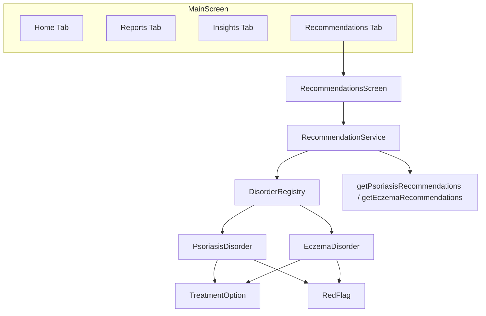

# Recommendations Tab - Comprehensive Plan

## Current State Summary

Your codebase already has substantial recommendation infrastructure:


| Component                 | Location                                                                                                                                                 | Status                                                                                   |
| ------------------------- | -------------------------------------------------------------------------------------------------------------------------------------------------------- | ---------------------------------------------------------------------------------------- |
| **RecommendationService** | [lib/services/recommendation_service.dart](lib/services/recommendation_service.dart)                                                                     | Rich content: psoriasis/eczema recs with RCT citations, efficacy %, GRADE-style evidence |
| **Recommendation model**  | [lib/models/recommendation_model.dart](lib/models/recommendation_model.dart)                                                                             | Structured: id, title, rationale, steps, benefits, evidence, source                      |
| **RecommendationsScreen** | [lib/screens/recommendations_screen.dart](lib/screens/recommendations_screen.dart)                                                                       | Uses duplicate Map-based data; not wired to RecommendationService                        |
| **Clinical data**         | [lib/data/psoriasis_clinical_data.dart](lib/data/psoriasis_clinical_data.dart), [lib/data/eczema_clinical_data.dart](lib/data/eczema_clinical_data.dart) | TreatmentOption, RedFlag, EvidencedTrigger with ClinicalEvidence                         |
| **Production app**        | [lib/main.dart](lib/main.dart)                                                                                                                           | 3 tabs only (Home, Reports, Insights) - no Recommendations tab                           |


**Gap**: RecommendationsScreen maintains its own `_getRecommendationsForCondition()` returning `Map<String, dynamic>` instead of using `RecommendationService.getPsoriasisRecommendations()` / `getEczemaRecommendations()` and `getRecommendationsForCondition()` (treatment-based).

---

## Architecture




---

## Phase 1: Add Recommendations Tab to Production App

**File**: [lib/main.dart](lib/main.dart)

- Add a 4th tab to `BottomNavigationBar`: "Recommendations" (icon: `Icons.recommend` or `Icons.medical_services`)
- Extend `body` branching: when `_selectedIndex == 3`, show `RecommendationsScreen`
- Pass `selectedCondition` from `MainScreen` state (same as Insights) and `DailyLogService` for personalization
- Update tab count from 3 to 4

**Note**: `selectedCondition` is already available in MainScreen. Ensure RecommendationsScreen receives it.

---

## Phase 2: Unify Data Source - Wire Screen to Service

**File**: [lib/screens/recommendations_screen.dart](lib/screens/recommendations_screen.dart)

**Remove**: The entire `_getRecommendationsForCondition()` method (lines 325-411) which returns hardcoded Map data.

**Replace with**: Call to `RecommendationService`:

```dart
List<Recommendation> _getRecommendations(String condition) {
  final treatmentBased = RecommendationService.getRecommendationsForCondition(condition);
  final conditionSpecific = condition == 'psoriasis'
      ? RecommendationService.getPsoriasisRecommendations()
      : RecommendationService.getEczemaRecommendations();
  // Merge, dedupe by title; prefer condition-specific when overlapping
  return _mergeRecommendations(conditionSpecific, treatmentBased);
}
```

**Personalization (optional enhancement)**: If `DailyLogService` is passed, call `RecommendationService.getPersonalizedRecommendations(condition, detectedTriggers, currentRiskScore)` and merge/prioritize with base recommendations.

**UI update**: Change `ListView.builder` to consume `Recommendation` objects instead of `Map<String, dynamic>`: use `rec.title`, `rec.rationale`, `rec.steps`, `rec.benefits`, `rec.evidence`, `rec.source`, `rec.priority`, `rec.tags`. The existing expandable card layout can stay; only the data binding changes.

---

## Phase 3: Enrich with Guideline & Council References

**File**: [lib/services/recommendation_service.dart](lib/services/recommendation_service.dart)

Add an explicit "Guideline Sources" section or metadata that the UI can display:

1. **Psoriasis**
  - National Psoriasis Foundation (NPF) Medical Board clinical recommendations
  - AAD/NPF joint guidelines (biologics, phototherapy, systemic nonbiologics)
  - NPF position statements (vaccination, severity clarification, telemedicine)
  - WHO ICD-10 L40
2. **Eczema / Atopic Dermatitis**
  - American Academy of Dermatology (AAD) Atopic Dermatitis Guidelines (2024-2025)
  - AAAAI/ACAAI Joint Task Force practice parameters
  - WHO ICD-10 L20

**Implementation options**:

- Add `List<GuidelineSource> guidelineSources` to each condition's recommendation set
- Or add a static `getGuidelineSources(String condition)` returning structured references
- Include URLs where appropriate (e.g., psoriasis.org/clinical-recommendations, aad.org/guidelines)

**File**: [lib/models/recommendation_model.dart](lib/models/recommendation_model.dart)

- Optionally add `String? guidelineBody` (e.g., "NPF", "AAD") to `Recommendation` for per-rec citation
- Or extend `source` to include guideline body: e.g., "AAD/NPF Joint Guideline, 2021; Journal of the American Academy of Dermatology, 2024"

---

## Phase 4: Comprehensive Content Coverage

Ensure each condition has recommendations spanning:


| Category                | Psoriasis                                                | Eczema                                 |
| ----------------------- | -------------------------------------------------------- | -------------------------------------- |
| **Lifestyle**           | Stress management, diet (optional)                       | Allergen reduction, itch-scratch cycle |
| **Skincare**            | Winter protocol, emollients                              | Soak & seal, ceramide products         |
| **Treatment adherence** | Medication timing                                        | Same                                   |
| **Medical treatments**  | Topicals, phototherapy, biologics (from TreatmentOption) | Topicals, JAK inhibitors, biologics    |
| **Trigger avoidance**   | Stress, cold weather, trauma, infection                  | Allergens, irritants, food triggers    |


**Current coverage**: `getPsoriasisRecommendations()` and `getEczemaRecommendations()` already cover lifestyle, skincare, adherence, and some triggers. `getRecommendationsForCondition()` adds treatment-based recs from `DisorderRegistry`. The merge in Phase 2 ensures no duplication and full coverage.

**Gaps to fill** (if any):

- Add 1-2 eczema-specific treatment recs (e.g., JAK inhibitors, dupilumab) to `RecommendationService.getEczemaRecommendations()` or ensure they flow from `EczemaDisorder.treatments`
- Verify `EczemaDisorder.treatments` in [lib/data/eczema_clinical_data.dart](lib/data/eczema_clinical_data.dart) is populated

---

## Phase 5: Guardrails

### 5.1 Clinical Disclaimer (Mandatory)

**File**: [lib/screens/recommendations_screen.dart](lib/screens/recommendations_screen.dart)

Add a persistent disclaimer banner at the top (mirror [lib/screens/insights_screen.dart](lib/screens/insights_screen.dart) lines 184-200):

```
These recommendations are for informational purposes only and are based on published clinical guidelines and peer-reviewed research. They are NOT a substitute for professional medical advice. Always consult your dermatologist or healthcare provider before starting or changing any treatment.
```

Use `Container` with orange/amber border, `Icons.warning`, similar to Insights.

### 5.2 Red Flags Section

**File**: [lib/screens/recommendations_screen.dart](lib/screens/recommendations_screen.dart)

Add a "When to Seek Urgent Care" section at the top (below disclaimer):

- Source: `DisorderRegistry.getDisorder(condition).redFlags`
- Display each `RedFlag` with: `symptom`, `urgency`, `whyImportant`, `actionToTake`
- Use color coding: red for emergency, orange for urgent
- Match styling from InsightsScreen if it has a similar section

### 5.3 Evidence Tier Display

**File**: [lib/screens/recommendations_screen.dart](lib/screens/recommendations_screen.dart)

In the expanded card, enhance "Scientific Evidence" section:

- Show evidence type badge (e.g., "RCT", "Meta-analysis", "Guideline")
- For recommendations sourced from `TreatmentOption`, use `TreatmentOption.evidence` and render `ClinicalEvidence.getCitation()`, `getDOILink()` as clickable
- Add "Evidence quality: High / Moderate / Supporting" based on `getEvidenceStrength()` logic

### 5.4 Clear "Consult Dermatologist" CTA

- Add a footer or sticky CTA: "Discuss these recommendations with your dermatologist" with optional link to find-a-derm (e.g., AAD Find a Dermatologist URL)
- On "Mark as Implemented" and "Save for Later", consider adding tooltip: "Share with your care team"

---

## Phase 6: Screen API Update

**Current**: `RecommendationsScreen` expects `selectedCondition` and `onBack`. It is used in a 4-tab layout in `app.dart` with navigation.

**Production**: In `main.dart`, Recommendations will be a tab (no back button). Update:

- Remove `onBack` requirement (or make it optional)
- Add optional `DailyLogService? dailyLogService` for personalization
- When used as tab: no back button; when used as pushed route: show back button

---

## File Change Summary


| File                                                                                 | Changes                                                                                                   |
| ------------------------------------------------------------------------------------ | --------------------------------------------------------------------------------------------------------- |
| [lib/main.dart](lib/main.dart)                                                       | Add 4th tab, RecommendationsScreen with condition + DailyLogService                                       |
| [lib/screens/recommendations_screen.dart](lib/screens/recommendations_screen.dart)   | Remove Map-based data; use RecommendationService; add disclaimer, red flags, evidence tier; optional back |
| [lib/services/recommendation_service.dart](lib/services/recommendation_service.dart) | Add `getGuidelineSources(condition)`; optionally add NPF/AAD citations to existing recs                   |
| [lib/models/recommendation_model.dart](lib/models/recommendation_model.dart)         | Optional: add `guidelineBody` or extend `source` format                                                   |


---

## Testing Checklist

- Recommendations tab visible and navigable in production app
- Psoriasis condition shows psoriasis-specific recs (stress, winter, adherence, diet, treatments)
- Eczema condition shows eczema-specific recs (allergen, moisturization, itch-scratch, food triggers, treatments)
- No duplicate recommendations when merging condition-specific + treatment-based
- Disclaimer and red flags always visible
- Evidence section shows source and (where available) clickable DOI/URL
- "Mark as Implemented" / "Save for Later" work (currently SnackBar only; optional: persist to Firestore)
- Personalization (if implemented): higher risk or detected triggers elevate relevant recs

---

## Optional Enhancements (Post-MVP)

- Persist "implemented" / "saved for later" to Firestore (FirestoreReportsService or new collection)
- Add "Export recommendations as PDF" for sharing with provider
- Pull guideline sources from a config file for easier updates
- Add PsA (psoriatic arthritis) and pediatric recs when expanding conditions

